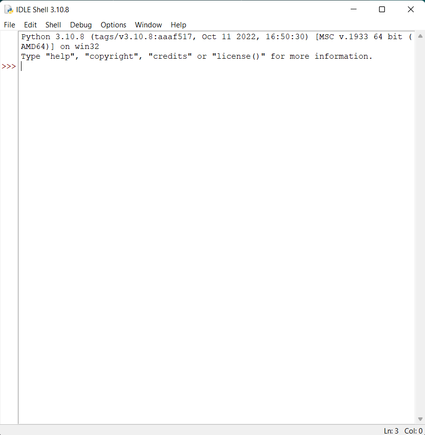
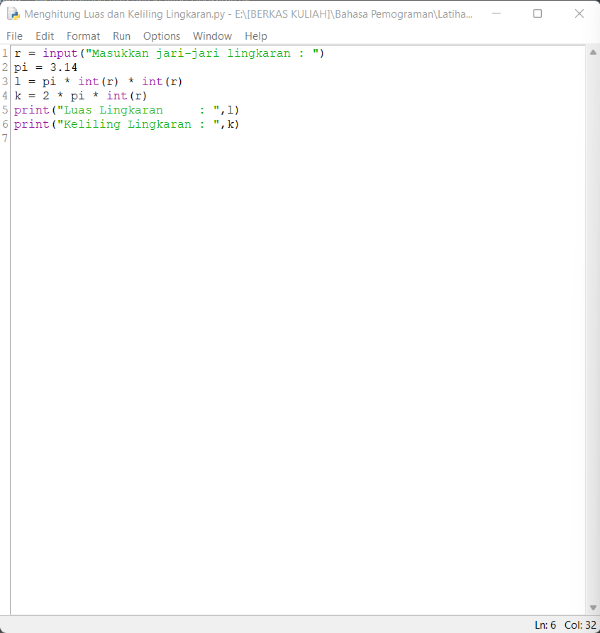
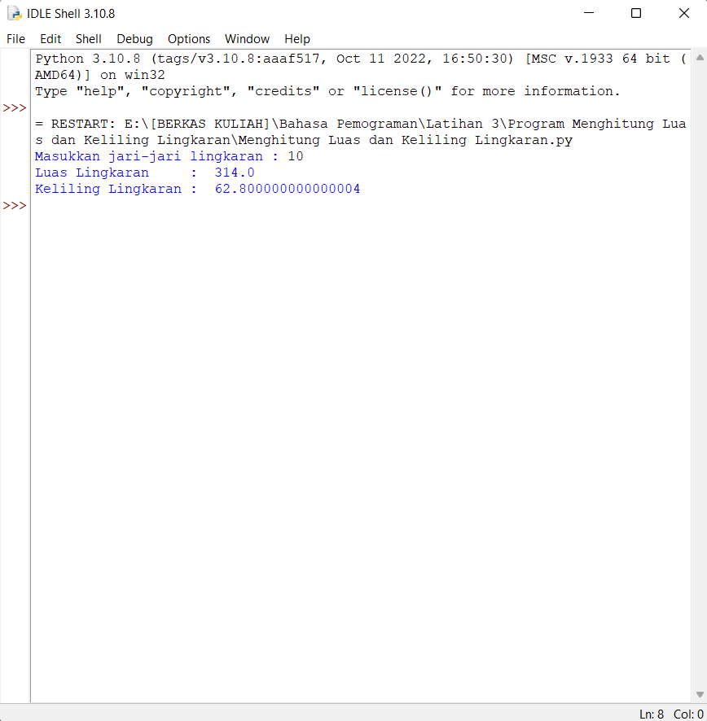
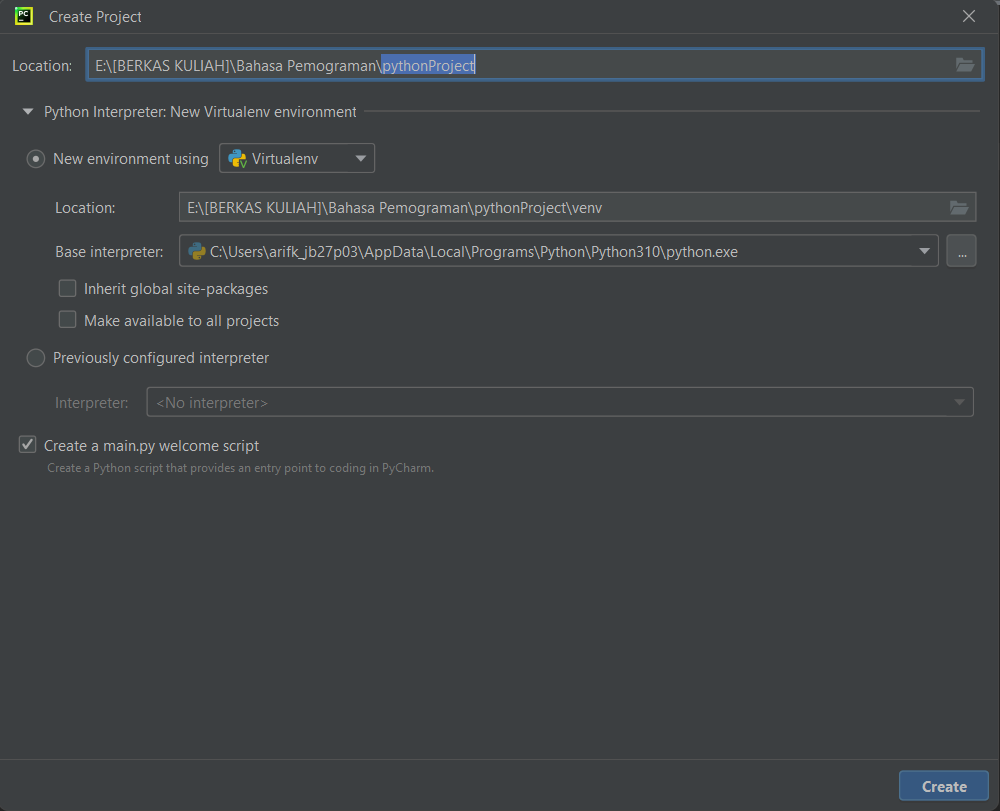
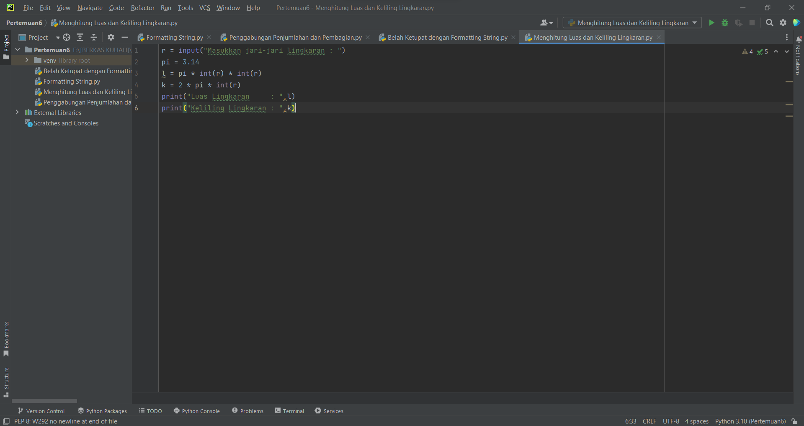
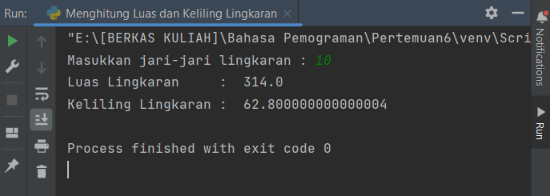
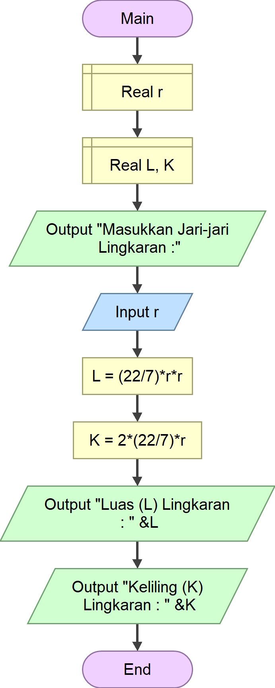
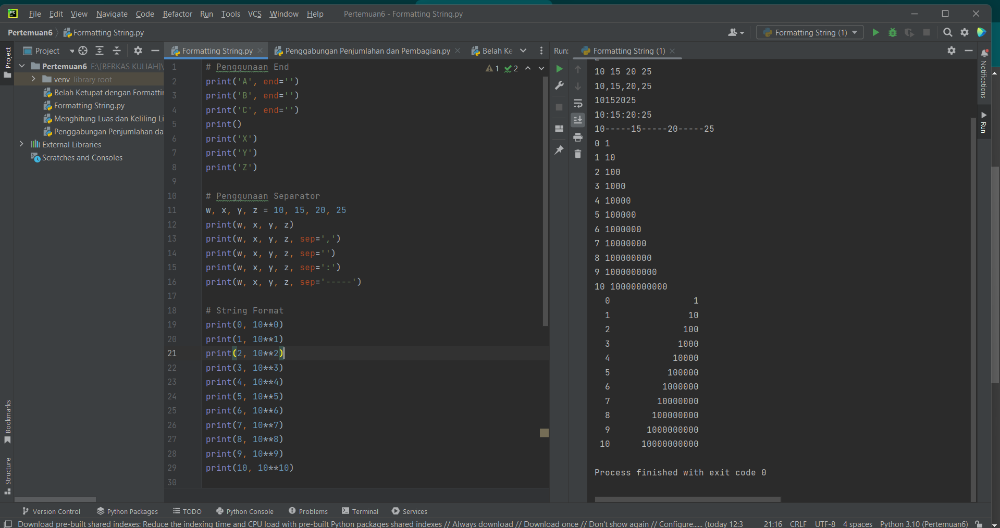
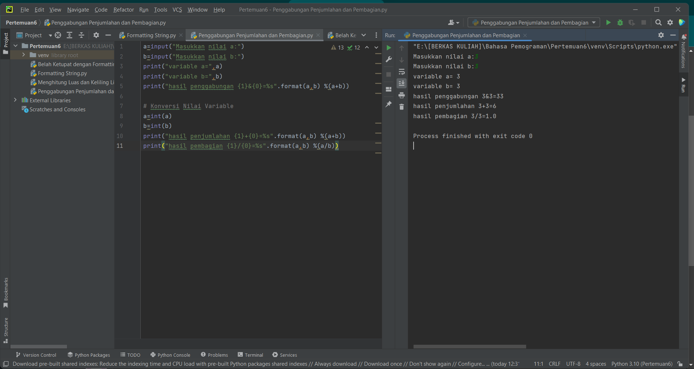
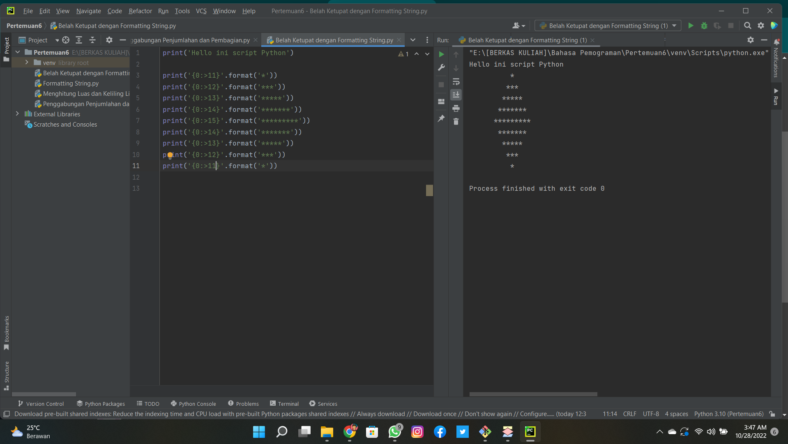

# 🧩 Menghitung Luas dan Keliling Lingkaran Dengan Bahasa Pemograman Python

## Menggunakan Program Idle Python
Buka Program Idle Python yang telah terinstal di Device kalian.

Masukkan sytax(perintah) menggunakan bahasa pemograman Python.

> r = input("Masukkan jari-jari lingkaran : ")
> 
> pi = 3.14
> 
> l = pi * int(r) * int(r)
> 
> k = 2 * pi * int(r)
> 
> print("Luas Lingkaran     : ",l)
> 
> print("Keliling Lingkaran : ",k)

Kemudian Run dan Input nilainya, nanti akan muncul hasilnya seperti ini. 

## Menggunakan Program Pycharm
Buka program Pycharm yang sudah terinstall di Device kalian,
lalu pilih 'New Project', beri nama project dan tempatkan sesuai keinginan kalian.

Masukkan syntax(perintah) menggunakan bahasa pemograman Python.

> r = input("Masukkan jari-jari lingkaran : ")
> 
> pi = 3.14
> 
> l = pi * int(r) * int(r)
> 
> k = 2 * pi * int(r)
> 
> print("Luas Lingkaran     : ",l)
> 
> print("Keliling Lingkaran : ",k)

Kemudian Run dan Input nilainya, nanti akan muncul hasilnya seperti ini.

# Flowchart

## Penjelasannya

1. Declare(Deklarasi) dengan variable r dengan Type Data 'Real' agar dapat menampilkan hasil pecahan.
2. Declare(Deklarasi) dengan variable L, K dengan Type data 'Real' agar dapat menampilkan hasil pecahan juga.
3. Output <"Masukkan Jari-jari Lingkaran :"> agar User mengerti harus menginput nilai jari-jarinya. 
4. Input variable r atau nilai jari-jari yang sudah di deklarasikan di atas.
5. Assign atau rumus untuk menghitung Luas jari-jari dengan Formula <L= (22/7)*r*r>
6. Assign atau rumus untuk menghitung Keliling jari-jari dengan Formula <K= 2*(22/7)*r>
7. Output untuk menampilkan hasil Luas Lingkaran dengan Variable L <"Luas (L) Lingkaran : " &L>
8. Output untuk menampilkan hasil Keliling Lingkaran dengan Variable L <"Keliling (K) Lingkaran : " &K>

Setelah semua proses selesai, run maka akan tampil seperti ini.

# Screenshots Praktikum Pertemuan 6
Ini adalah Capture Project yang dikerjakan saat pertemuan ke-6 Mata Kuliah Bahasa Pemograman.

## Formatting String

## Penggabungan, Penjumlahan, dan Pembagian

## Membuat Ketupat Dengan Formatting String

